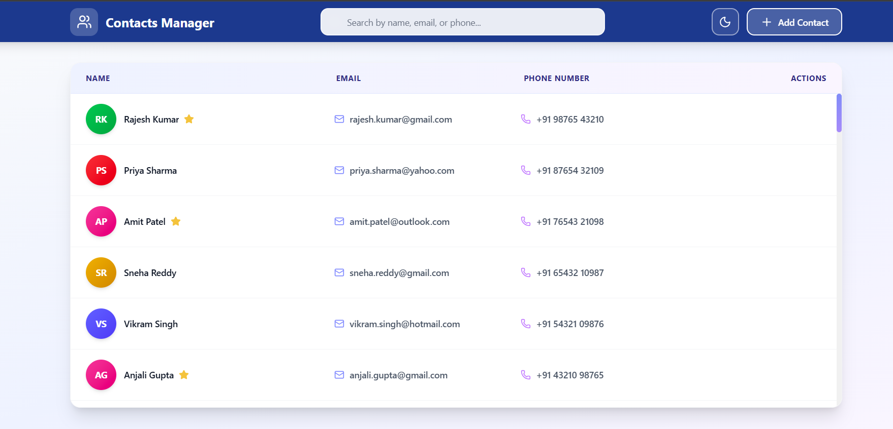

# Contacts Manager

A modern contacts management application built with React, Vite, and Tailwind CSS. This app provides a clean interface for managing your contacts with features like dark mode, real-time search, and persistent storage.


## Screenshot



## Live Demo

The application is deployed and accessible at: https://smart-contactmanager.netlify.app/

## Notable Features

- **Full CRUD Operations**: Add, edit, delete, and manage contacts with a simple interface
- **Real-time Search**: Instantly filter contacts by name, email, or phone number as you type
- **Dark Mode**: Toggle between light and dark themes with preferences saved locally
- **Favorites**: Star important contacts to keep them easily accessible
- **Clickable Links**: Email addresses and phone numbers are clickable for quick actions
- **Persistent Storage**: All data saves automatically to your browser's localStorage
- **Responsive Design**: Works smoothly on both desktop and mobile devices
- **Smooth Animations**: Polished UI with fade-in effects and smooth transitions

## Setup Instructions

To run this project locally on your machine:

1. **Prerequisites**: Make sure you have Node.js (v18 or higher) installed

2. **Clone the repository**:

```bash
git clone https://github.com/raksha39/contacts-manager.git
cd contacts-manager
```

3. **Install dependencies**:

```bash
npm install
```

4. **Start the development server**:

```bash
npm run dev
```

5. **Open your browser** and navigate to `http://localhost:5173`

To build for production, run `npm run build`. The optimized files will be in the `dist` folder.

## Libraries Used

**React (18.3)** - I chose React for its component-based architecture and efficient rendering. It makes managing state and building interactive UIs straightforward.

**Vite (6.0)** - Selected as the build tool because it's incredibly fast during development with hot module replacement and has a much simpler configuration compared to webpack.

**Tailwind CSS (4.0)** - Used for styling because it lets me build custom designs quickly with utility classes without writing custom CSS. The gradient and animation utilities made it easy to create the modern UI.

**Lucide React** - Provides a clean, consistent set of icons. I prefer it over other icon libraries because the icons are lightweight and look professional.

## Design Choices and Assumptions

**localStorage for Data**: I used browser localStorage instead of a database since this is a client-side application. This means data is stored locally on your device and won't sync across different browsers or devices. For a production app, you'd want to add a backend API.

**50 Demo Contacts**: The app comes pre-loaded with sample contacts using Indian names and phone numbers in +91 format. This gives users something to interact with immediately when they first open the app.

**Gradient Avatars**: Instead of requiring profile pictures, the app generates colorful gradient avatars with initials. This keeps the design consistent and eliminates the need for image uploads.

**Component Structure**: I separated the add and edit functionality into different modal components even though they're similar. This makes the code easier to maintain and modify independently.

**Form Validation**: The app validates email format and phone number format before saving. This prevents invalid data from entering the system, though the phone validation is specifically designed for Indian numbers (+91 format).

## Project Structure

```
contacts-manager/
├── public/                    # Static assets
├── src/
│   ├── components/
│   │   ├── header.jsx        # Main header with search, dark mode toggle, and add button
│   │   ├── contact-list.jsx  # Contact list display with actions
│   │   ├── add-contact-modal.jsx   # Modal for adding new contacts
│   │   └── edit-contact-modal.jsx  # Modal for editing existing contacts
│   ├── data/
│   │   └── contacts.json     # Initial demo contact data (50 contacts)
│   ├── assets/               # Images and other assets
│   ├── App.jsx               # Main app component with state management
│   ├── App.css               # App-specific styles
│   ├── main.jsx              # Application entry point
│   └── index.css             # Global styles and animations
├── eslint.config.js          # ESLint configuration
├── vite.config.js            # Vite configuration
├── package.json              # Dependencies and scripts
└── README.md                 # Project documentation
```

## Author

Raksha - [@raksha39](https://github.com/raksha39)

---

Note: This project uses localStorage for data persistence. For production environments, consider implementing a backend API.
